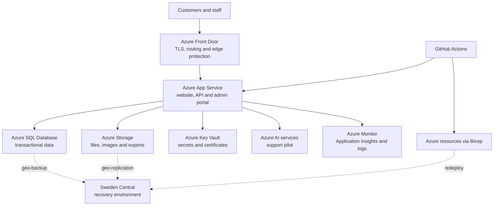

# Target Architecture: Nordic Eats Azure Platform

| Document details | |
| --- | --- |
| Company | Nordic Eats (fictional case study) |
| Prepared by | Amin Azad |
| Date | 2 August 2026 |
| Status | Draft for technical and cost validation |

## 1. Purpose

This document translates Nordic Eats' business requirements and current-state findings into a practical Azure design. The aim is to remove the office as the production hosting location, improve recovery and deployment, and give the small IT team better control without building an enterprise platform that it cannot afford or operate.

The design uses managed Azure services wherever that removes useful maintenance work. It is sized for approximately 40,000 monthly users and a normal operating target close to **5,000 DKK per month**. Final service tiers must be confirmed after two to four weeks of workload measurements and a detailed Azure cost estimate.

## 2. Design principles

The architecture follows six principles:

1. **Keep operations manageable.** One IT administrator should not have to patch and maintain a large collection of virtual machines.
2. **Build for recovery, not just backup.** Critical transactional data must meet a 15-minute RPO, and the customer service must be recoverable within four hours.
3. **Protect the data layer.** Public traffic can reach the application, but databases, storage and secrets should use private access.
4. **Automate repeatable work.** Bicep and GitHub Actions will be the normal route for infrastructure and application changes.
5. **Pay for the resilience the business needs.** The design meets the agreed targets without funding an always-on copy of every service in a second region.
6. **Introduce AI after the core platform is stable.** The support assistant begins as a limited, monitored pilot using approved content only.

## 3. Architecture overview

West Europe is the primary Azure region because it is close to Nordic Eats' users and supports the proposed services. Sweden Central is the recovery region. The office becomes a consumer of the platform rather than its production host.

The diagram shows logical relationships rather than every subnet or resource. Detailed addressing, service tiers, resource names and firewall rules will be defined in the technical design and Bicep modules.

## 4. Recommended Azure services

| Need | Proposed service | Why it fits Nordic Eats |
| --- | --- | --- |
| Global entry point | Azure Front Door Standard | Provides one public endpoint, TLS termination, health-based routing and a route to the recovery region when it is activated. |
| Application hosting | Azure App Service for Linux | Runs the website, API and admin application without VM maintenance. Multiple instances and autoscale support the availability and growth requirements. |
| Transactional database | Azure SQL Database | Keeps SQL compatibility while adding managed backups, point-in-time restore, patching and built-in availability. |
| Application content | Azure Blob Storage | Suits product images, uploads and exports better than local application disks. Lifecycle rules can control long-term cost. |
| Business file shares | Azure Files | Preserves familiar file-share access where the business still needs folders and permissions. |
| Secrets | Azure Key Vault | Removes passwords, keys and connection details from code and deployment files. |
| Workload identity | Managed identities | Lets applications access Azure services without storing service credentials. |
| Private data access | Virtual Network, private endpoints and Private DNS | Keeps SQL, Storage and Key Vault off the public internet while allowing the application to reach them. |
| Monitoring | Azure Monitor, Application Insights and Log Analytics | Brings application performance, errors, platform logs, security signals and alerts into one operational view. |
| Identity and administration | Microsoft Entra ID and Azure RBAC | Supports individual accounts, MFA, least-privilege roles and auditable administration. |
| Delivery automation | GitHub Actions with OpenID Connect | Automates testing and deployment without keeping long-lived Azure credentials in GitHub. |
| Infrastructure automation | Bicep | Makes the environment repeatable, reviewable and recoverable from version-controlled definitions. |
| Cost control | Azure Cost Management budgets, alerts and tags | Gives management early warning of overspend and supports monthly ownership and cost reviews. |

## 5. Application design

The customer website, API and administration portal will initially use one App Service plan to control cost. They should be deployed as separate web applications when their code and release process allow it. This gives them independent settings and releases while still sharing the underlying compute capacity.

The customer API should remain stateless. User sessions, uploaded files and durable jobs must not depend on a particular App Service instance. This allows at least two production instances during normal operation so that one instance can fail or restart without stopping the full customer service.

Deployment slots will provide a staging location for release validation. GitHub Actions will deploy to the slot, run smoke tests and then swap the tested version into production. If the new version fails, the previous slot provides a quick rollback path. Database changes still require their own backward-compatible migration and recovery plan; a slot swap cannot reverse a destructive database change.

Autoscale will respond to measured demand, with conservative minimum and maximum limits to protect the budget. Non-production applications can run on smaller capacity or on a schedule where the selected service tier permits it.

## 6. Data design

### Transactional database

Azure SQL Database will hold customers, products, orders and operational status. It is preferred over SQL Server on an Azure VM because Nordic Eats does not need operating-system control and has only one administrator. The managed service reduces patching, backup and high-availability work.

Before migration, the team must run a SQL compatibility assessment and identify SQL Agent jobs, linked servers, unsupported features and cross-database dependencies. The final purchasing model and compute tier will be chosen from measured CPU, memory, storage and transaction activity rather than the current server specification alone.

Automated backups and point-in-time restore will protect normal recovery. Backup frequency and the selected recovery design must be tested to prove the **15-minute RPO**. Long-term retention is configured only where business or regulatory policy requires it.

### Files and application objects

Application images, uploads and exports will move to Blob Storage. Shared business folders that still need SMB-style access will move to Azure Files after obsolete data and permissions are cleaned up.

Storage will use encryption, private endpoints, soft delete and versioning where appropriate. Lifecycle policies will move or remove old objects according to the approved retention schedule. Applications will use managed identity and narrowly scoped data roles instead of storage account keys.

## 7. Network and access design

The public path is deliberately short: customers reach Azure Front Door, which forwards approved traffic to App Service. The database, storage accounts and Key Vault are not directly exposed to the internet.

App Service uses regional virtual-network integration to reach private endpoints. Private DNS zones resolve the private service names inside the virtual network. Network security groups control subnet traffic where they add useful protection, while service firewalls deny unapproved paths.

The administration portal remains internet reachable only if staff genuinely need it remotely. It should use Entra-based sign-in, MFA and application-level authorization. Restricting it by identity is more practical for this small team than maintaining a permanent VPN solely for the portal. Direct platform administration remains through Entra ID and Azure RBAC; no public RDP or SSH endpoints are required because the design has no production virtual machines.

## 8. Identity and security

Microsoft Entra ID becomes the central identity source for Azure administration. Privileged users must use MFA, individual accounts and separate administrative roles. Access is assigned to groups wherever practical and reviewed quarterly.

Applications use managed identities to retrieve secrets from Key Vault and access data services. GitHub Actions uses workload identity federation through OpenID Connect. This removes long-lived deployment secrets from the repository.

Security controls include:

- TLS for all external and service-to-service traffic;
- encryption at rest using Azure-managed keys initially;
- private endpoints for SQL, Storage and Key Vault;
- least-privilege Azure RBAC and data-plane roles;
- diagnostic and administrative logs sent to the central workspace;
- dependency, code and secret scanning in the delivery pipeline;
- Defender for Cloud recommendations reviewed at a scope and plan level that fits the budget; and
- documented retention, access and deletion procedures to support GDPR obligations.

Payment-card details remain with the external payment provider. If discovery finds that Nordic Eats stores or processes card data itself, the architecture and compliance scope must be reviewed before migration.

## 9. Availability, backup and disaster recovery

### Normal service availability

The primary production environment runs in West Europe. App Service uses at least two instances during production operation, Azure SQL provides managed platform availability, and Front Door monitors the application endpoint. This design supports the **99.9% monthly availability** target while avoiding dependence on the Copenhagen office.

### Recovery approach

Nordic Eats' four-hour RTO does not require a fully active duplicate platform in a second region. Maintaining one would materially increase the monthly cost. The recommended design is a **pilot-light recovery model**:

1. The Bicep templates define a deployable application foundation in Sweden Central.
2. SQL backups are stored with geographic redundancy and can be restored in the recovery region.
3. Storage uses an appropriate geo-redundant option for critical application data.
4. Required container images or application packages remain available through the deployment process.
5. During a declared regional disaster, the team deploys or scales the recovery application, restores data, validates critical journeys and switches Front Door routing.

This approach must be timed in a quarterly exercise. If it cannot repeatedly meet the four-hour RTO and 15-minute RPO, Nordic Eats must either fund a warm standby database/application or revise the targets. Backup restoration and regional failover are separate tests; success in one does not prove the other.

## 10. Monitoring and operations

Application Insights records request rates, response times, dependencies, exceptions and availability tests. Azure Monitor collects platform metrics and diagnostic logs in Log Analytics. The operational dashboard should show only information that helps the small team act: customer availability, error rate, slow requests, database health, failed deployments, backup status, security events and current cost.

Initial alerts will cover:

- application unavailability or high server error rate;
- sustained response-time degradation;
- database capacity or connection problems;
- failed backup or recovery jobs;
- unusual privileged changes;
- expiring secrets or certificates where automatic rotation is unavailable; and
- budget thresholds and unexpected daily cost growth.

Each high-severity alert must identify an owner and link to a short runbook. The team should tune alerts after the first month so that repeated non-actionable notifications do not hide real incidents.

## 11. CI/CD and infrastructure as code

The GitHub repository is the source of truth for application code, Bicep modules, workflow definitions and documentation. Normal changes follow a pull-request review before merging.

The infrastructure pipeline will:

1. lint and build the Bicep files;
2. validate the proposed Azure deployment;
3. show the expected change where practical;
4. require approval for production; and
5. deploy through an OpenID Connect identity with limited permissions.

The application pipeline will install dependencies, run tests and security checks, build the release, deploy to the staging slot, run smoke tests and promote the release. Production and non-production settings, identities and data remain separate.

## 12. AI customer-support pilot

The AI assistant is intentionally outside the critical order-processing path. It will answer a limited set of questions using approved Nordic Eats material such as delivery areas, opening hours and published refund guidance.

The pilot will use an Azure-hosted language model with retrieval from an approved knowledge store. The application layer controls prompts, content access, rate limits and logging. It will not receive unrestricted database access or perform refunds, payments or account changes.

Every conversation must disclose that the customer is interacting with an automated assistant and offer human escalation. The team will monitor answer quality, unsupported-answer rate, escalation, user feedback, token usage and cost. The feature can be disabled without affecting ordering if it performs poorly or exceeds its budget.

## 13. Environment model

| Environment | Purpose | Cost approach |
| --- | --- | --- |
| Development | Developer integration and early testing | Small shared capacity; no production data |
| Test/Staging | Release validation and migration rehearsal | Deployment slot or scheduled capacity where practical |
| Production | Customer and administration services | Minimum resilient capacity with controlled autoscale |
| Recovery | Regional disaster recovery in Sweden Central | Infrastructure defined in code; minimal or no idle compute until activation |

Production data must not be copied into non-production without masking and approval. Access, settings and deployment approvals remain separate even where environments share a cost-saving service plan.

## 14. Key architecture decisions

| Decision | Reason | Main trade-off |
| --- | --- | --- |
| Use App Service instead of virtual machines | Less patching and simpler scaling for a small team | Less operating-system control |
| Use Azure SQL Database instead of SQL Server on a VM | Managed availability, backup and patching | Application compatibility must be verified |
| Use Front Door as the public entry point | Consistent TLS, health routing and future DR routing | Adds cost and another service to operate |
| Use private endpoints for data services | Reduces unnecessary public exposure | Adds DNS and network complexity |
| Share an App Service plan initially | Keeps the startup design affordable | Workloads share compute capacity |
| Use pilot-light regional recovery | Better fit for the four-hour RTO and budget | Recovery is not instantaneous and requires orchestration |
| Use Bicep and GitHub Actions | Repeatable infrastructure and delivery with an auditable history | The team must learn and maintain automation |
| Limit the first AI use case | Controls privacy, quality and spend | The assistant cannot handle every support request |

## 15. Requirements coverage

| Requirement area | Architecture response |
| --- | --- |
| Availability and scale (BR-01–05) | Multiple App Service instances, autoscale, managed data services and Front Door health routing |
| Security and privacy (BR-06–12) | Entra ID, MFA, RBAC, managed identity, Key Vault, TLS, private endpoints and central audit logs |
| Backup and recovery (BR-13–17) | Point-in-time database restore, geo-redundant data protection, Bicep recovery deployment and quarterly exercises |
| Releases (BR-18–23) | GitHub Actions, OpenID Connect, Bicep, deployment slots, approvals and rollback procedures |
| Monitoring and operations (BR-24–28) | Azure Monitor, Application Insights, Log Analytics, actionable alerts and runbooks |
| Cost control (BR-29–33) | Shared and right-sized capacity, scheduled non-production, budgets, alerts and tags |
| Data migration (BR-34–38) | Compatibility assessment, integrity checks, private access and source retention through acceptance |
| AI support (BR-39–44) | Approved knowledge, restricted data access, monitoring, disclosure and human escalation |
| Migration and handover (BR-45–48) | Phased deployment, version-controlled design, acceptance gates, documentation and recovery exercises |

## 16. Items requiring validation

The architecture can be approved in principle, but the following items affect sizing, cost or technical feasibility:

1. Application runtime, statelessness, background jobs and deployment dependencies
2. SQL Server compatibility, peak utilization, transaction rate and actual backup-log frequency
3. File volume, access method, permissions, growth and retention
4. Peak requests, response-time target and seasonal demand
5. Office-to-Azure migration bandwidth and acceptable cutover window
6. Required Entra ID licensing and current Microsoft 365 licensing
7. Log volume and appropriate retention period
8. Which data requires cross-region recovery and the tested restore duration
9. Support-question volume, approved AI knowledge and supported languages
10. Detailed monthly estimate for the selected regions, tiers and usage

## 17. Recommendation and next step

Nordic Eats should accept this design as the target direction, subject to workload validation and a detailed cost model. It removes the largest current risks without introducing unnecessary virtual machines or an expensive always-on secondary platform.

The next document should be the detailed migration strategy. It will turn this design into waves, define the database and file migration methods, set cutover and rollback gates, and identify the tests required before the on-premises systems can be retired.

## 18. Review and approval

| Role | Name | Decision | Date |
| --- | --- | --- | --- |
| Executive Sponsor | To be assigned | Pending | — |
| Product Owner | To be assigned | Pending | — |
| IT Administrator | To be assigned | Pending | — |
| Development Lead | To be assigned | Pending | — |
| Project Lead | Amin Azad | Pending | — |
